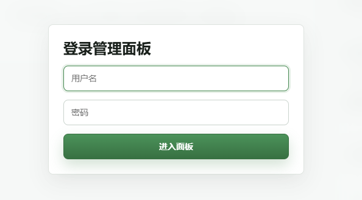
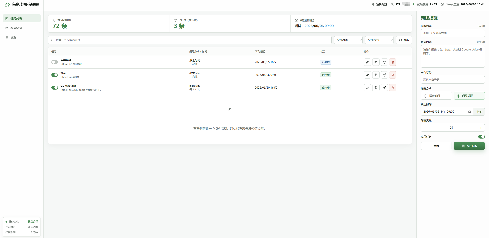
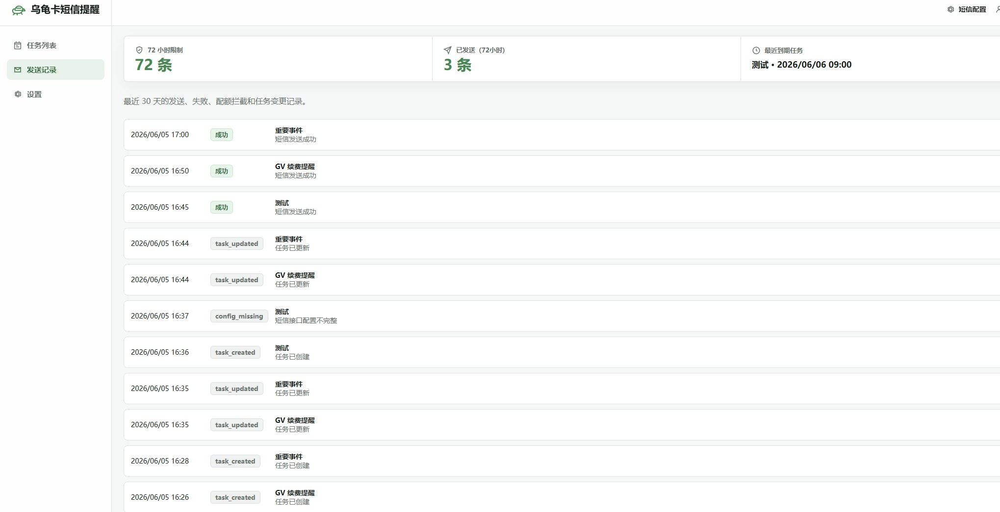
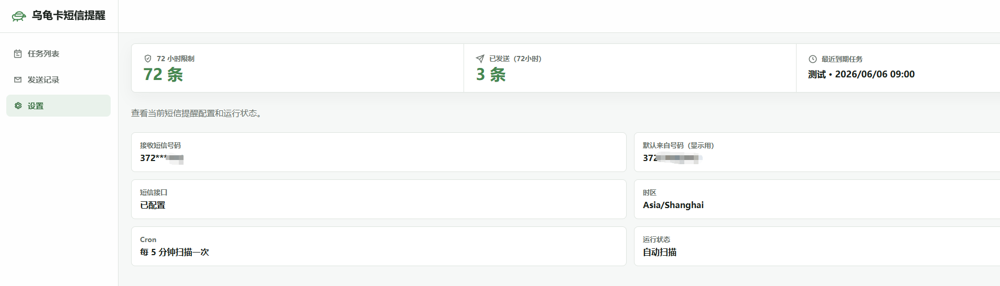

# 乌龟卡短信定时提醒 Cloudflare Worker 版

一个单文件 Cloudflare Worker 项目，用乌龟卡 / esimgg 的 Nekoko API 给自己发短信，并支持一次性提醒、按天间隔提醒、发送记录、启用暂停、手动测试发送和 72 小时限额保护。

乌龟卡是爱沙尼亚的esim，官网本身就支持给自己的号码发送短信，同时也开放了 API，具体可以查看 [esim.gg 官方说明文档](https://esim.gg/)。这个功能本质上就是通过 HTTP GET 调用接口给自己的乌龟卡号码发短信，“来自号码”只要符合格式即可，并不一定需要真实存在。常规用手机日历或第三方 App 做定时通知也可以，但换手机、跨品牌迁移时经常要重新导入、同步和配置，尤其是手机日历从一个品牌迁到另一个品牌会更麻烦；如果用邮箱、IM、应用推送等方式提醒，又容易被折叠、静默或错过，不够强提醒。短信会直接进入手机短信列表，更适合 GV 续期、账号检查、重要日期、打开某个网站处理事情这类不想漏掉的提醒。乌龟卡这个自发短信功能通常是免费的，但官方有频率限制，常见提示是 72 小时内 72 条，本项目也内置了对应限额保护，避免正常使用时打爆额度。

核心文件：

- `worker.js`
- `README.md`
- `img/` 使用截图

## 特点

- 首页就是登录页，登录后进入管理面板。
- 管理用户名、密码、乌龟卡 API Key、接收短信号码都放在 Cloudflare 环境变量里。
- 浏览器端不会保存或暴露乌龟卡 API Key。
- 所有任务时间按北京时间处理，也就是 `Asia/Shanghai` / UTC+8。
- 指定时间任务可以选择发送成功后自动删除。
- 默认保护乌龟卡免费推送限制：72 小时最多发送 72 条。
- 使用 Cloudflare KV 存储任务、发送记录和配额计数。
- 使用 Cloudflare Cron Triggers 定时扫描到期任务。

## 使用截图









## Cloudflare 需要配置的内容

### 1. 创建 Worker

在 Cloudflare Dashboard 创建一个 Worker，把 [worker.js](worker.js) 的内容粘进去。

也可以在 GitHub 仓库里只放 `worker.js` 和 `README.md`，然后用 Cloudflare Workers 的 Git 集成部署，入口文件选择 `worker.js`。

### 2. 绑定 KV

创建一个 KV Namespace，然后在 Worker 的 Bindings 里添加：

```text
Variable name: TASKS_KV
Type: KV Namespace
```

代码里固定使用 `TASKS_KV` 这个名字。

### 3. 配置环境变量

在 Worker 的 Variables and Secrets 里添加这些变量：

```text
ADMIN_USERNAME=admin
ADMIN_PASSWORD=换成你的强密码
ESIMGG_API_KEY=你的乌龟卡 API Key
ESIMGG_TARGET_NUMBER=你的乌龟卡接收短信号码
DEFAULT_FROM=默认来自号码（只控制短信里显示的发送方）
SMS_QUOTA_LIMIT=72
QUOTA_WINDOW_HOURS=72
```

说明：

- `ADMIN_USERNAME`：登录管理面板的用户名。
- `ADMIN_PASSWORD`：登录管理面板的密码。
- `ESIMGG_API_KEY`：乌龟卡 API key。
- `ESIMGG_TARGET_NUMBER`：接收短信的乌龟卡号码，例如 `372...`，这是必填项。
- `DEFAULT_FROM`：默认来自号码，例如 `3721111111`，只控制短信里显示的发送方，不是接收号码。
- `SMS_QUOTA_LIMIT`：72 小时窗口内最多发送多少条，默认 `72`。
- `QUOTA_WINDOW_HOURS`：配额统计窗口，默认 `72` 小时。

建议把 `ADMIN_PASSWORD` 和 `ESIMGG_API_KEY` 设置为 Secret。

### 4. 配置 Cron Triggers

在 Worker 的 Triggers 里添加 Cron：

```text
*/5 * * * *
```

这表示每 5 分钟扫描一次到期任务。Worker 内部会按北京时间显示和理解任务时间。

## 乌龟卡 API

项目内部调用的是：

```text
https://api.nekoko.tel/sms/send/{ESIMGG_TARGET_NUMBER}?apikey={ESIMGG_API_KEY}&from={FROM}&body={BODY}
```

这个调用只发生在 Worker 端，前端不会直接请求乌龟卡接口。

## 使用方式

1. 打开 Worker 地址。
2. 用 `ADMIN_USERNAME` 和 `ADMIN_PASSWORD` 登录。
3. 新建提醒：
   - `指定时间`：例如北京时间 `2026-06-09 09:00`。
   - `间隔提醒`：例如每隔 `25` 天提醒一次 GV 续期。
4. 指定时间任务可以打开 `完成后自动删除`，发送成功后任务会从列表移除。
5. 点击时间输入框里的 `上午` / `下午` 可以快速切换 AM/PM，日期和分钟保持不变。
6. 可以在任务列表里启用、暂停、编辑、复制、删除或手动发送。
7. 发送记录里可以看成功、失败、配额拦截和任务变更。

## 短信模板变量

短信内容支持两个简单变量：

```text
{{title}} 当前任务标题
{{date}}  当前北京时间
```

例如：

```text
{{title}}：该续期 GV 了。当前时间 {{date}}
```

## 注意

- 乌龟卡官方免费推送通常有 72 小时 72 条限制，本项目默认会在 Worker 侧拦截超限发送。
- 如果官方给你提高了额度，可以调整 `SMS_QUOTA_LIMIT`。
- Worker Cron 不是秒级定时，适合提醒类任务，不适合精确到秒的通知。
- KV 是最终一致性存储，少量个人提醒场景足够用；如果要多人高频使用，建议改成 D1。
